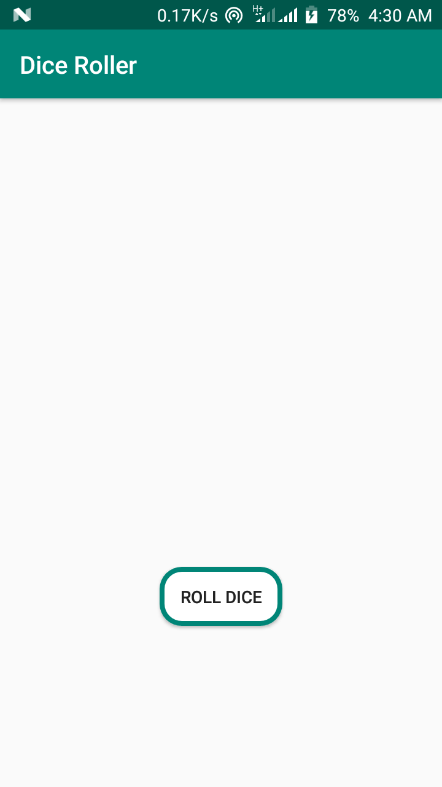
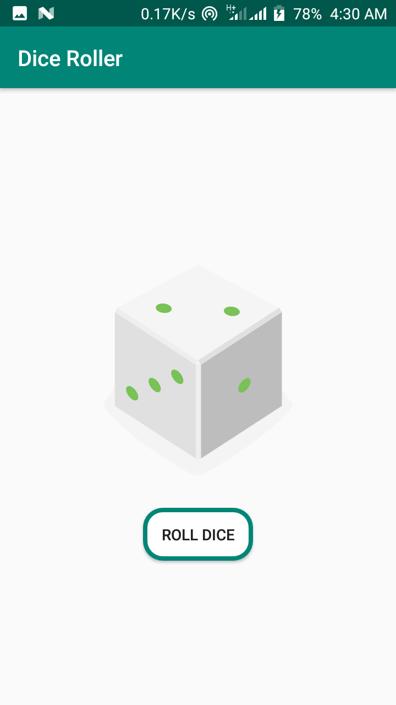

 # Dice Roller App

   
  

This is a simple app that allows you to roll a dice with six
faces using a button. It's an app that I built in my beginner 
class for Android Dev't with Kotlin

## Table of Contents
* [Features](#features)
* [Setup](#setup)
* [License](#license)
### Features
* Six face dice 
* Button to roll the dice
### Setup
* Install [Android studio](https://developer.android.com/studio)
* Install [Android Development Tools](https://docs.oracle.com/en/middleware/developer-tools/jet/tutorials/jetma/index.html)
#### Gradle 
    gradle-5.4.1-all.zip
#### dependecies 
    implementation 'androidx.appcompat:appcompat:1.0.2'
    implementation 'androidx.core:core-ktx:1.0.2'
    implementation 'androidx.constraintlayout:constraintlayout:1.1.3'

### License
This project is licensed under [Apache License 2.0](./LICENSE) terms 
